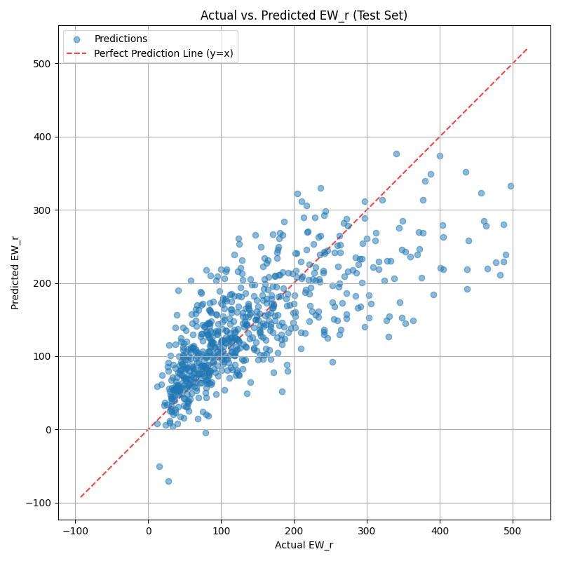
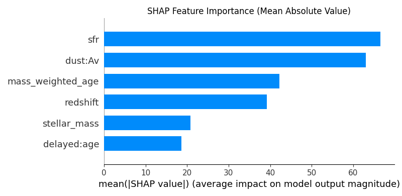
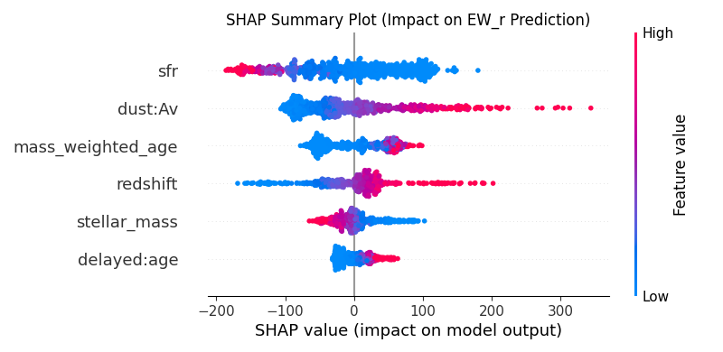

# Predicting Lyman-alpha Equivalent Width with XGBoost

This project predicts the rest-frame Lyman-alpha Equivalent Width ($EW_r$) of galaxies using an XGBoost model based on their physical properties. The `Model.py` script handles data filtering, hyperparameter optimization, model training, and evaluation.

**This project seeks to answer the following key questions:**
1. Can machine learning be used to accurately predict Lyman-alpha emission (specifically $EW_r$) from a galaxy, using its physical properties?
2. Which galaxy properties have the greatest impact on Lyman-Alpha emission predictions?

## Data Preparation

The initial dataset (`data.csv`) contained 11862 galaxies. (Note: 4 rows were removed early due to invalid target values). It was filtered based on data quality:
*   Photometric fit $\chi^2_{phot} < 100$ (Rows remaining: 9462)
*   Ly&alpha; Signal-to-Noise ratio $sn > 5.3$ (Rows remaining: 3763)
*   Rest-frame Ly&alpha; Equivalent Width $EW_r < 500$ (Rows remaining: 3393)
This resulted in a final dataset of 3393 galaxies, split into 80% training (2714) and 20% testing (679) sets. Features were standardized using `StandardScaler` fitted on the training data.

## Features

### Response Variable:
*   **`EW_r`**: Rest-frame Equivalent Width (EW / (1 + $z_{Ly\alpha}$)).

### Data Quality Flags Used for Filtering:
*   **`chisq_phot` ($\chi^2_{phot}$)**: Chi-squared value from photometric fitting.
*   **`sn` (SN)**: Signal-to-noise ratio of the detected emission line (unitless).

### Explanatory Variables:
*   **`dust:Av`**: Dust attenuation in V-band (Mag).
*   **`stellar_mass`**: Logarithm of the current stellar mass ($`log_{10}(M_{\odot})`$).
*   **`sfr`**: Star Formation Rate ($M_{\odot}/yr$).
*   **`mass_weighted_age`**: Mass-weighted age of the stellar population (Gyr).
*   **`redshift`**: Galaxy redshift.
*   **`delayed:age`**: Logarithm of the characteristic timescale from the delayed- $\tau$ star formation history model ($log_{10}(\tau)$ [Myr]).

## XGBoost Model Building

1.  **Finding Good Settings (Hyperparameter Tuning):**
    *   XGBoost models have several settings (hyperparameters) that affect performance. To find good values, we automatically tested 300 different combinations using Randomized Search.
    *   Each combination was evaluated using 5-fold cross-validation (totalling 1500 fits across all candidates) on the training data to get a reliable performance score (based on minimizing prediction error - Mean Squared Error).
    *   The best combination of settings found during the search was:
        ```python
        {
            'colsample_bytree': 0.9213923721539394,
            'gamma': 0.14101728628565324,
            'learning_rate': 0.06323186313391685,
            'max_depth': 3,
            'n_estimators': 291,
            'reg_alpha': 2.879622876290423,
            'reg_lambda': 3.926591021198561,
            'subsample': 0.6510758917689862
        }
        ```

2.  **Training the Final Model:**
    *   We trained the final XGBoost model using the best settings found above (excluding `n_estimators`) on the full training data.
    *   We used "early stopping" to prevent the model from becoming too complex (overfitting). This technique monitors performance on the separate test set during training and stops when the performance hasn't improved for 50 consecutive steps.
    *   The final model used **486** boosting steps (estimators), determined by the early stopping process monitoring test set performance.

## Results

### Test Set Performance
*   **R²:** 0.5533
*   **RMSE:** 65.5153
*   **MAE:** 47.0874

### Feature Importance (SHAP)
The mean absolute SHAP values for all features are:
1.  `sfr` (66.600685)
2.  `dust:Av` (63.091873)
3.  `mass_weighted_age` (42.184021)
4.  `redshift` (39.157883)
5.  `stellar_mass` (20.823074)
6.  `delayed:age` (18.633131)

## Visualizations

*   **Actual vs. Predicted Plot:**
    

*   **SHAP Feature Importance (Bar Plot):**
    

*   **SHAP Summary Plot (Dot Plot):**
    