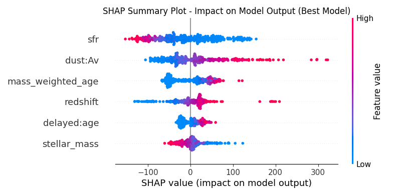

# Predicting Lyman-alpha Equivalent Width with XGBoost

This project predicts the rest-frame Lyman-alpha Equivalent Width ($EW_r$) of galaxies using an XGBoost model based on their physical properties. The `Model.py` script handles data filtering, hyperparameter optimization, model training, and evaluation.

## Data Preparation

The initial dataset (`data.csv`) contained 11862 galaxies. It was filtered based on data quality:
*   Photometric fit $\chi^2_{phot} < 50$ (Rows remaining: 7119)
*   Ly&alpha; Signal-to-Noise ratio $sn > 5.5$ (Rows remaining: 2174)
*   Rest-frame Ly&alpha; Equivalent Width $EW_r < 500$ (Rows remaining: 1965)
This resulted in a final dataset of 1965 galaxies, split into 80% training (1572) and 20% testing (393) sets. Features were standardized using `StandardScaler` fitted on the training data.

## Features

### Target Variable
*   **`EW_r`**: Rest-frame Equivalent Width (EW / (1 + $z_{Ly\alpha}$)).

### Explanatory Variables
*   **`dust:Av`**: Dust attenuation in V-band (Mag).
*   **`stellar_mass`**: Logarithm of the current stellar mass ($log_{10}(M_{\odot})$).
*   **`sfr`**: Star Formation Rate ($M_{\odot}/yr$).
*   **`mass_weighted_age`**: Mass-weighted age of the stellar population (Gyr).
*   **`redshift`**: Galaxy redshift.
*   **`delayed:age`**: Logarithm of the characteristic timescale from the delayed-$\tau$ star formation history model ($log_{10}(\tau)$ [Myr]).

## XGBoost Model Building

1.  **Finding Good Settings (Hyperparameter Tuning):**
    *   XGBoost models have several settings (hyperparameters) that affect performance. To find good values, we automatically tested 300 different combinations using Randomized Search.
    *   Each combination was evaluated using 5-fold cross-validation (totalling 1500 fits across all candidates) on the training data to get a reliable performance score (based on minimizing prediction error - Mean Squared Error).
    *   The best combination of settings found was:
        ```python
        {'colsample_bytree': 0.921, 'gamma': 0.141, 'learning_rate': 0.063, 'max_depth': 3, 'n_estimators': 291, 'reg_alpha': 2.880, 'reg_lambda': 3.927, 'subsample': 0.651}
        ```

2.  **Training the Final Model:**
    *   We trained the final XGBoost model using the best settings found above on the training data.
    *   We used "early stopping" to prevent the model from becoming too complex (overfitting). This technique monitors performance on the separate test set during training and stops when the performance hasn't improved for 50 consecutive steps.
    *   The final model used 418 boosting steps (estimators), determined by the early stopping process monitoring test set performance.

## Results

### Test Set Performance
*   **R²:** 0.514
*   **RMSE:** 69.55
*   **MAE:** 47.95

### Feature Importance (SHAP)
The mean absolute SHAP values for all features are:
1.  `sfr` (58.84)
2.  `dust:Av` (54.90)
3.  `mass_weighted_age` (39.28)
4.  `redshift` (30.36)
5.  `delayed:age` (18.62)
6.  `stellar_mass` (18.14)

## Visualizations

*   **SHAP Feature Importance (Bar Plot):**
    

*   **SHAP Summary Plot (Dot Plot):**
    